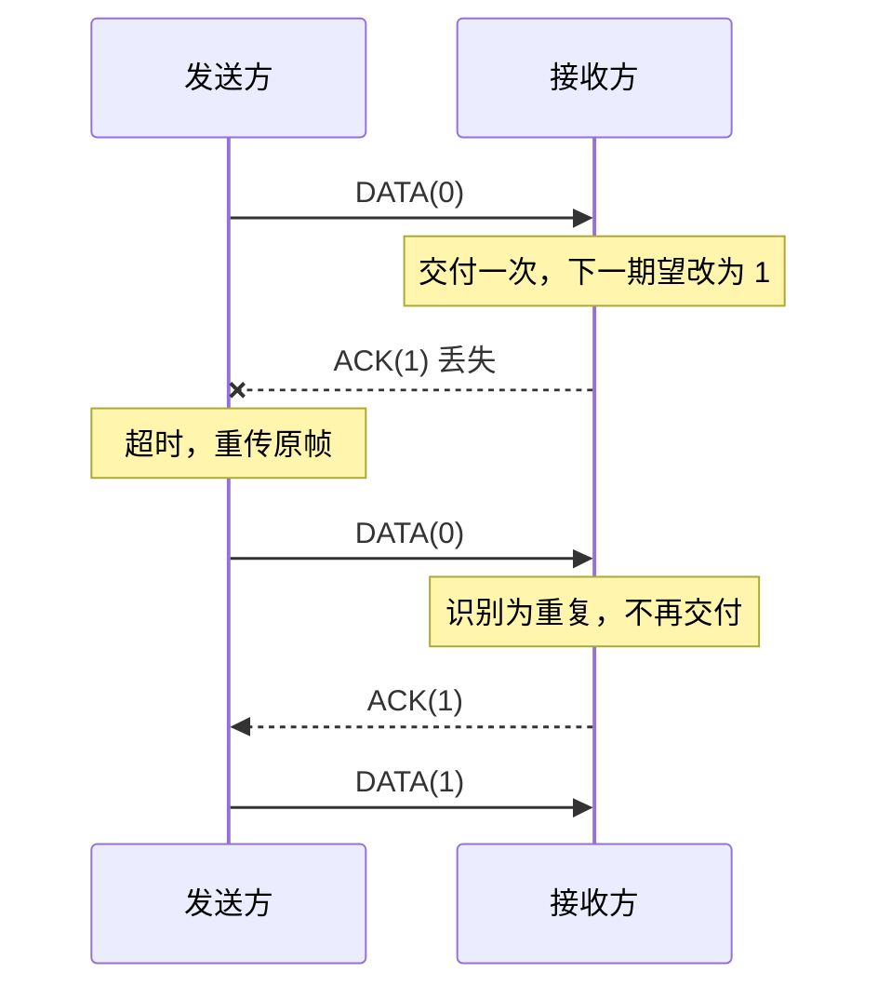

# 可靠传输：停等与滑动窗口

> 来源：第 3 章课件 PDF 第 50—95 页；`note4.pdf` 第 1 页。前置：[差错检测](04-error-control.md)。

## 1. 从理想协议逐步增加机制

| 模型 | 假设还成立什么 | 新问题 | 增加什么 |
| --- | --- | --- | --- |
| 乌托邦单工 | 无错、不丢、接收处理无限快 | 无需等待 | 连续发送与接收 |
| 无错停等 | 不出错、不丢帧 | 接收速度有限 | 发一帧，等许可再发下一帧 |
| 有错停等 ARQ | 可能损坏或丢失 | 数据帧或 ACK 丢失，出现重复 | 检错、定时器、序号、确认 |
| 流水线 ARQ | 同时有多个未确认帧 | 如何缓存、确认与重传 | 滑动窗口、GBN 或 SR |

手写 `note4.pdf` 的“dummy frame（哑帧）”对应**无错停等模型**：确认只需表示“可以继续”。到了有错 ARQ，确认必须能关联正确的数据帧，不能仍假定任意到达的 ACK 都可放行。

“单工协议”在本章通常指业务数据单向流动；反向 ACK 仍需要通信通路。

## 2. 先约定 ACK 的含义

课件不同图例混用了两种记法：

- `ACK(k)` 表示“已经收到 k 号帧”。
- `ACK(k)` 表示“下一帧期望 k，之前的帧已按序收到”。

本篇的**停等与 GBN**采用第二种，即“下一期望序号”；**基本 SR**使用单独确认，明确写作 `ACK_SR(k)`，只表示已收到 k 号帧。看题时先检查约定，否则很容易把窗口多移或少移一格。

## 3. 有错停等：一个序号位为何足够

在教材的基本链路模型中，同时只有一帧等待确认。序号交替取 0、1，用来区分本帧和下一帧；默认没有跨越多个序号循环仍存活的任意延迟旧副本。

发送方保存当前帧，发送后启动计时器；只有有效且匹配的 ACK 才推进序号。超时重发当前帧。收到损坏或不匹配的 ACK 不推进，等待超时即可。

接收方只将校验通过且序号为当前期望的帧交给上层，之后切换期望序号；重复帧不重复交付，但应再次确认。

### ACK 丢失的完整过程

定时器负责“未收到确认怎么办”；序号负责“重传后如何避免重复交付”。CRC 只能发现其能力范围内的位错误，不能替代这两项机制。

## 4. 停等效率：先画出一轮时间

令完整数据帧长度为 $L$ bit、速率为 $R$ bit/s，数据帧发送时间 $t_f=L/R$；单程传播时间为 $t_p$；ACK 发送时间为 $t_a$；收发处理合计为 $t_{proc}$。

无错、没有额外排队、收到完整帧后才确认时：

$$T_{cycle}=t_f+2t_p+t_a+t_{proc},\qquad U=\frac{t_f}{T_{cycle}}.$$

忽略 ACK 发送及处理时延，并令 $D=2t_p$（不含数据帧发送时间），则

$$U=\frac{L/R}{L/R+D}=\frac{L}{L+RD}.$$

**纠偏：**课件第 63 页比较 $F<D$，但 F 是比特数，D 是秒，量纲不一致。利用率低于 50% 的条件应为 $L/R<D$，或 $L<RD$。

### 课件卫星例题

$L=1000$ bit，$R=1$ Mbit/s，单程传播时间 270 ms：

$$t_f=1\ \mathrm{ms},\quad T_{cycle}=1+540=541\ \mathrm{ms},\quad U=1/541\approx0.1848\%.$$

有效吞吐量在忽略其他开销时仅约 $1848.4$ bit/s。若一帧只有 $P$ bit 是有效载荷，净吞吐量还应使用 $P/T_{cycle}$。

帧变长可以减少等待占比，但会增加发送时间和重传代价。若各位独立、误码率为 $p$，长度 L 的帧至少一位出错的概率为 $1-(1-p)^L$；这一概率公式依赖独立误码假设。

## 5. 滑动窗口：让多帧同时在途

发送窗口大小 $W_s$ 限制允许在尚未确认时发送的帧范围。窗口里既可能有“已发未确认”帧，也可能有“允许发送但尚未发出”帧，不是永远装满未确认帧。

收到 ACK 后，窗口下沿越过连续已确认的部分；发送一帧本身只推进“下一待发送序号”，不代表该帧已经从未确认区移除。

理想无错、等长帧、ACK 与处理开销忽略时：

$$U\approx\min\left(1,\frac{W_st_f}{t_f+2t_p}\right).$$

要连续发送而不因等待 ACK 空闲，需

$$W_s\ge\left\lceil1+\frac{2t_p}{t_f}\right\rceil.$$

上面的卫星例题需至少 541 帧。$R\times2t_p$ 是往返传播带宽时延积，表示等待往返反馈期间可发出的比特量；窗口还必须满足协议序号空间的限制。

## 6. GBN：回退 N

基本 Go-Back-N 的接收窗口 $W_r=1$，只接收下一期待帧，丢弃乱序帧；用累计 ACK 表示已经按序收齐的前缀。发送方超时后，从最老未确认帧开始，重传所有已发送但未确认的帧。

基本实现可只给最老未确认帧维护逻辑计时器；课件某些实现使用逐帧计时器，但核心区别仍是“超时后的重传范围”。

### 丢失 2 号帧

发送 0、1、2、3，2 丢失：接收方交付 0、1 后期待 2。3 到达时被丢弃，仍回复 `ACK(2)`。发送端收到 `ACK(2)` 说明 0、1 已收到，不代表 2 已收到；2 超时后重传 2、3，以及此时其他已发未确认帧。

若只是早期 ACK 丢失，但后来更大的累计 ACK 到达，它可以覆盖前面的确认，避免不必要重传。

### 序号上限

序号字段 k 位，序号空间 $N=2^k$：

$$W_s\le2^k-1,\qquad W_r=1.$$

如果 $W_s=N$，接收方收到完整一轮后又期待 0；若 ACK 全丢，发送方重传的旧 0 可能被误认成下一轮的新 0。留出序号空间可避免基本模型中的这种歧义。

## 7. SR：选择重传

基本 Selective Repeat 对各帧独立确认。接收方缓存窗口内正确但乱序的帧，等缺口补上后按序交付；发送方只重传相应超时帧。通常为各未确认帧维护逻辑定时器。

同样发送 0、1、2、3，2 丢失时，3 被缓存并返回 `ACK_SR(3)`；2 超时后只重传 2，接收端再依次交付 2、3。

收到单独 ACK 只标记对应帧。若窗口下沿仍有未确认帧，不能因为后面的帧已确认就越过缺口滑动。

### 旧重复帧也可能需要重新确认

接收方可能已交付某帧并移过窗口，但其 ACK 丢失。发送方重传时，接收方应识别相关的上一窗口重复帧、重新发 ACK，而不重复交付。不能把“窗口外帧全部直接丢弃且永不确认”当作完整的基本 SR 处理规则。

### 为什么窗口不能超过半个序号空间

等大发送、接收窗口的基本 SR 要求

$$W_s=W_r=W\le2^{k-1}.$$

例如 k=2，序号 0—3，若 W=3：接收方收到 0、1、2 后，新窗口可能是 `{3,0,1}`。如果 ACK 全丢，旧 0 重传就落入新窗口，被误认成新数据。因此新旧窗口必须留足区分空间。

一般窗口约束可写为 $W_s+W_r\le2^k$，这里仍采用教材基本滑动窗口模型。课件的 $2^{k-1}$ 不能写成 GBN 的 $2^k-1$。

## 8. 横向对比与计算

| 项目 | 停等 | GBN | 基本 SR |
| --- | --- | --- | --- |
| 发送窗口 | 1 | 多帧 | 多帧 |
| 接收窗口 | 1 | 1 | 多帧 |
| 确认 | 当前交互帧 | 累计确认 | 各帧单独确认 |
| 乱序帧 | 不按新帧交付 | 丢弃 | 窗口内缓存 |
| 超时重传 | 当前帧 | 已发未确认的一段帧 | 对应超时帧 |
| 主要代价 | 等待导致利用率低 | 已正确到达的后续帧也可能重传 | 缓存与状态管理更复杂 |

课件还给出了结合 NAK、捎带确认与累计信息的实现变体。学习时先掌握上表基本模型，再逐字段分析代码，避免把不同 ACK 约定混在一起。

**纠偏：**课件第 89 页关于 SR 效率不如 GBN 的表述不能概括所有丢包场景。数据帧丢失时，SR 常能避免重传已缓存帧；单独 ACK 丢失时，GBN 的后续累计 ACK 可能具有优势。比较要明确丢的是数据还是 ACK，以及误码率、窗口与确认策略。

对需要窗口 541 的卫星例题：GBN 至少 k=10（$2^{10}-1=1023$），等窗口 SR 至少 k=11（$2^{10}=1024$）。序号宽度也会影响协议能否填满链路。

## 自测与答案

1. 3 bit 序号，GBN 与等窗口 SR 的发送窗口最大值？**7 与 4。**
2. ACK 丢失后收到重复数据应再次交付吗？**不交付，但要按协议重新确认。**
3. GBN 中 `ACK(5)` 按本篇约定确认到哪？**累计确认到 4，期待 5（在当前序号轮次内）。**
4. SR 收到 7 的 ACK，但窗口下沿 5 仍未确认，能把下沿移到 8 吗？**不能。**
5. $t_f=2$ ms、$t_p=9$ ms，忽略 ACK 等开销，停等利用率及填满窗口？**10%；至少 10 帧。**

[返回目录](../README.md) · [下一篇：PPP 与 PPPoE](06-ppp-and-pppoe.md)
