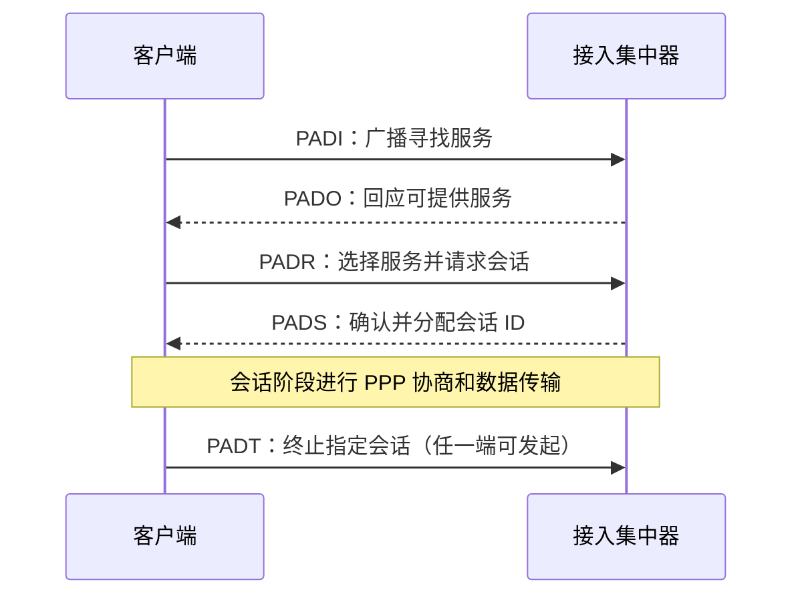

# PPP 与 PPPoE

> 来源：第 3 章课件 PDF 第 97—117 页；与 `note3.pdf` 第 1 页的点到点协议提示衔接。协议细节以文末 RFC 为核对依据。

## 1. PPP 的三个组成部分

PPP（Point-to-Point Protocol）用于在点到点链路上承载不同网络层协议。

| 部分 | 作用 |
| --- | --- |
| 封装 | 表示协议类型与数据边界，承载上层分组 |
| LCP（Link Control Protocol） | 建立、配置、测试和终止链路，协商链路选项 |
| NCP（Network Control Protocols） | 针对不同网络层协议配置通信参数，例如 IPv4 的 IPCP |

它可以协商认证，但认证不是每次都必须发生。基本 PPP 支持检错，通常丢弃检测出错误的帧；不通过业务数据帧的序号、确认和重传提供 ARQ 可靠交付，也不提供这类数据帧的流量控制。控制协议的请求/应答及重试不能与数据可靠交付混为一谈。依据：[RFC 1661](https://datatracker.ietf.org/doc/html/rfc1661)。

**纠偏：**PPP 不是“同步传输协议”的全称；它是点到点协议，可以使用适当的同步或异步链路承载。

## 2. HDLC 类 PPP 帧格式

课件讨论的常见未压缩、16 bit FCS 格式：

```text
Flag | Address | Control | Protocol | Information | FCS | Flag
 1B  |   1B    |   1B    |    2B    |    可变     | 2B  | 1B
 7E  |   FF    |   03    |          |             |     | 7E
```

协议字段指出信息部分是什么：

| Protocol | 含义 |
| --- | --- |
| `0x0021` | IPv4 数据报 |
| `0x8021` | IPCP，即配置 IPv4 的 NCP |
| `0xC021` | LCP |

这里的 FF 与 03 是该基本格式的固定字段，不能当作以太网 MAC 地址或停等帧序号。协议允许协商某些字段压缩和 FCS 选项，上图是课堂基础格式，不代表所有承载形式。

信息字段常以 1500 字节为默认接收上限；MRU 是最大接收单元的协商项，MTU 是本端发送时的最大传输单元。它们都不等于加上全部定界符、转义后在线路上实际传输的总字节数。

## 3. 透明传输

### 字节填充

在字节填充方式中，转义字节为 `0x7D`。需转义的字节前加 `0x7D`，原字节异或 `0x20`：

| 原字节 | 转义后的字节 |
| --- | --- |
| `0x7E` | `0x7D 0x5E` |
| `0x7D` | `0x7D 0x5D` |
| `0x03`（被要求转义时） | `0x7D 0x23` |

异步链路中还可依据 ACCM（异步控制字符映射）确定需要转义的控制字符。不要把简化的“ESC 后原样跟一个字节”与 PPP 的异或规则混淆。

### 比特填充

在比特填充方式中，发送方对两端 FLAG 之间的相应帧内容，每遇连续 5 个 1 插入 0；接收端去除填入的 0。FCS 在填充前计算，接收端去填充后校验。同步链路还有不同的成帧方式，因此“所有同步 PPP 都只能用比特填充”过于绝对。依据：[RFC 1662 §4—5](https://www.rfc-editor.org/info/rfc1662/)。

## 4. PPP 的建立与终止


理解时把“物理连接可用”“PPP 链路协商完成”“网络层协议可传输数据”分开。认证若启用且失败，就不能沿正常成功路径进入业务通信；某个 NCP 关闭也不必然意味着所有网络层协议和整个物理链路同时关闭。

## 5. PPPoE 为什么存在

PPPoE（PPP over Ethernet）将 PPP 会话放到以太网上，使用户可与接入集中器建立独立会话，便于结合认证与计费。客户端可以是个人主机，也可以是替局域网用户拨号的路由器。

它的典型过程包括发现、会话，以及终止：



### 类型与代码

| 项目 | 值 | 含义 |
| --- | --- | --- |
| EtherType | `0x8863` | 发现报文及 PADT |
| EtherType | `0x8864` | 会话阶段数据 |
| PADI Code | `0x09` | 寻找接入集中器 |
| PADO Code | `0x07` | 提供服务 |
| PADR Code | `0x19` | 请求会话 |
| PADS Code | `0x65` | 确认会话 |
| PADT Code | `0xA7` | 终止会话 |
| 会话数据 Code | `0x00` | PPP 会话数据 |

**纠偏：**课件 PDF 第 116 页把 PADO 与 PADT 都写成 `0x07`；PADT 应为 `0xA7`。依据：[RFC 2516 §5.5](https://datatracker.ietf.org/doc/html/rfc2516#section-5.5)。

PPPoE 头部有版本/类型、代码、会话 ID、长度等字段，共 6 字节；会话由会话 ID 与两端以太网地址共同标识。

### 为什么常见 MTU 是 1492

在以太网有效载荷上限 1500 字节、基本 PPPoE 封装条件下：

$$1500-6\text{（PPPoE 头）}-2\text{（PPP 协议字段）}=1492\text{ 字节}.$$

这是给定承载上限下的推导，不是所有扩展环境都不能超过的物理定律。PPPoE 的以太网封装不需要再复制串行 PPP 的整套 Flag、Address、Control、FCS 字段。依据：[RFC 2516 §6—7](https://datatracker.ietf.org/doc/html/rfc2516#section-6)。

## 6. 认证、加密与可靠性分开判断

- 认证回答“通信对方是谁或能否证明持有凭据”。
- 加密回答“第三方能否直接读取数据”。
- 差错检测回答“传输中是否检出了损坏”。
- 可靠交付涉及确认、重传、序号和交付语义。

**纠偏：**课件对 PPPoE 的描述容易让人以为建立会话就自动加密。基础 PPPoE 封装本身不提供通用的数据加密；具体保护取决于另外使用的协议与选项，不能把“有认证”直接等同于“内容已加密”。

## 自测与答案

1. LCP 和 NCP 谁先工作？**先配置 PPP 链路，再配置相应网络层协议。**
2. `0x8021` 代表所有 NCP 的统一类型吗？**不是，它专指 IPCP。**
3. 原字节 `0x7D` 怎样透明传输？**编码为 `0x7D 0x5D`。**
4. 基本 PPP 的 CRC 检出坏帧后是否必然通过 ARQ 重传？**不是，基本数据服务不提供这种可靠传输。**
5. PPPoE 的 PADT Code？**`0xA7`，不是 PADO 的 `0x07`。**

[返回目录](../README.md) · [回顾：停等与滑动窗口](05-arq-and-sliding-window.md)
